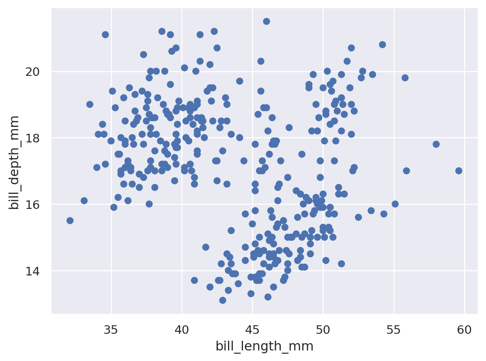

# HW 1 - CS 625, Spring 2024

AJ Broderick *(UIN 01244170)* <br>
Due: January 17, 2024

## Git, GitHub

*What is the URL of the GitHub repo that you created in your personal account?* <br>
https://github.com/odu-cs625-datavis/Spring24-asv-aj-broderick
   
*In which direction does the 'push' command work (send local changes to remote OR send remote changes to local)?* <br>
The push command pushed the the work upstream to the current branch. When the push command is executed it pushes the local repository to a remote repository.
   
*You have committed a change on your local machine/remote. However, you want to undo the changes committed. How would you do that?* <br>
Local changes can be changed using the code: <br>
```
git checkout -- <filename>
```
which replaces the changes in the working tree with the last content in HEAD.

## Markdown

*Create a bulleted list with at least 3 items* <br>
* List Item 1
* List Item 2
* List Item 3

*Write a single paragraph that demonstrates the use of italics, bold, bold italics, code, and includes a link. The paragraph does not have to make sense.* <br>
This is a general paragraph, meant to replace a *paragrah*, for the purpose of demonstrating **bold** usages of markdown. Other ***important*** topics covered in this section included links, such as <https://rogerdudler.github.io/git-guide/>, that were used to pull example of code below:
```
print('hello world')
```

*Create a level 3 heading* <br>
### Level 3 heading

*Insert a image of your house, sized appropriately* <br>


## Tableau

*Insert the image of your horizontal bar chart here. Reminder, this should show top 10 state names that has highest population in USA.* <br>


## Google Colab

*What is the URL of your Google Colab notebook?* <br>
<https://colab.research.google.com/drive/1ozyS7hjbiBcZAZ6IaDJxXBQEmIOiJYvy?usp=sharing>

## Python/Seaborn

*Insert the first penguin chart here* <br>


*Describe what the figure is showing.* <br>
The chart is a scatter plot where each plot is one of the observed penguins. The x-axis is the penguins bill length(in mm), with the bill depth(in mm). A chart like this is normally used to visually look for a correlation between the x and y axis inputs.

*Insert the second penguin chart here* <br>


*Describe what the figure is showing.* <br>
This chart is a grouped bar chart, where there are multiple groups, include the species of the penguin along with the penguins gender. The bars in this bar chart represent that average body mass(in g), for each of the different groupings.

*What happened when you removed the outer parentheses from the code? Why?* <br>
An error code of "SyntaxError: invalid syntax" is given and there is no other output. Given that python is a tabbed based editor, the removal of the outer parenthesis misaligns the tabs giving the error stated.

## Observable and Vega-Lite

*What happens when you replace `markCircle()` with `markSquare()`?* <br>
The marks on the scatter plot change from a circle to a square.

*What happens when you replace `markCircle()` with `markPoint()`?* <br>
The marks on the scatter plot change from a circle to a point (hollowed out circle).

*What change do you need to make to swap the x and y axes on the scatterplot?* <br>
Change the x() to y(), and the y() to x() 
```
vl.markCircle()
  .data(cars)
  .encode(
    vl.y().fieldQ("Horsepower"),
    vl.x().fieldQ("Miles_per_Gallon"),
    vl.tooltip().fieldN("Name")
  )
  .render()
```

*Insert the bar chart image here* <br>


*Why do you think this chart is the result of this code change?* <br>
By removing the line of code, the output is no longer grouping the data by the "Origin" field. This removed the breakout by the different countries and now showcases a bar chart of the count of all car models in the data.

## References

*Every report must list the references (including the URL) that you consulted while completing the assignment. Replace the items below with the references you consulted*

* git - the simple guide, <https://rogerdudler.github.io/git-guide/>
* Adding a file to a repository, <https://docs.github.com/en/repositories/working-with-files/managing-files/adding-a-file-to-a-repository>
* Plot in Vega-Lite, <https://www.example.com](https://observablehq.com/@observablehq/plot-vega-lite>
* Seaborn object bars, <https://seaborn.pydata.org/generated/seaborn.objects.Bars.html)https://seaborn.pydata.org/generated/seaborn.objects.Bars.html>
