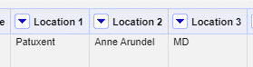
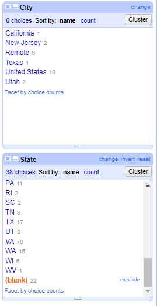
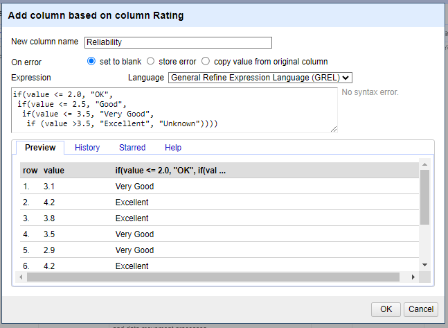
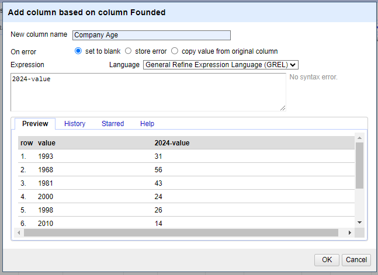
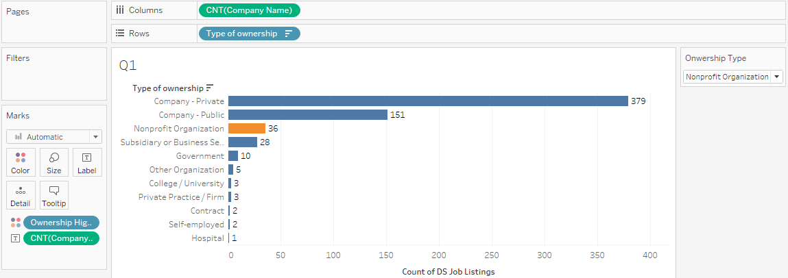
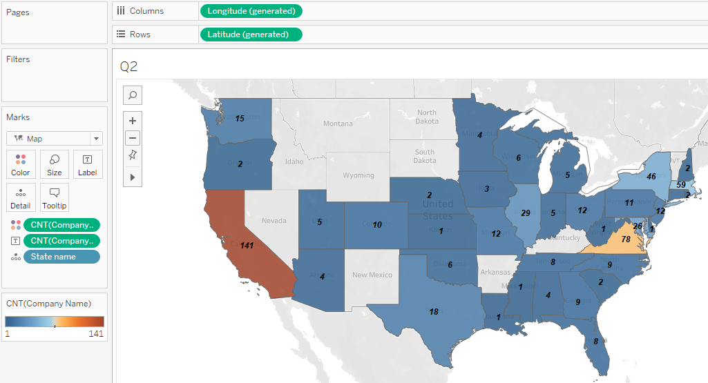
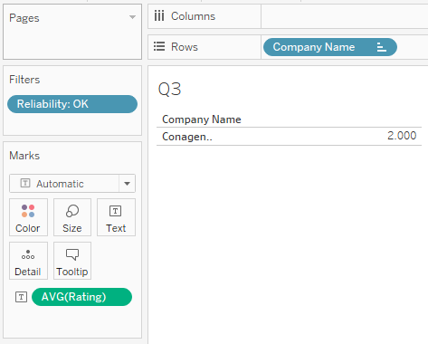
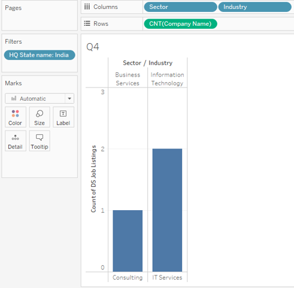
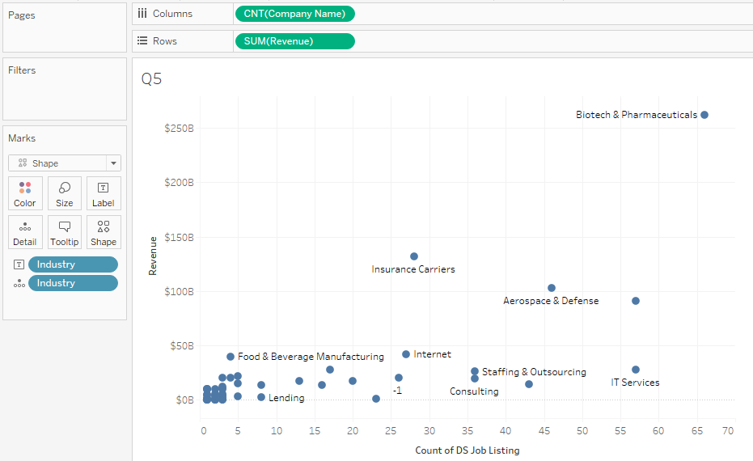

# HW 2 - CS 625, Spring 2024

AJ Broderick *(UIN 01244170)* <br>
Due: January 31, 2024

**Links to associated assignment files**\
[HW2-DSjobs.csv](https://github.com/odu-cs625-datavis/Spring24-asv-aj-broderick/blob/main/files/HW2-DSjobs.csv)\
[HW2-DSJobs.json](https://github.com/odu-cs625-datavis/Spring24-asv-aj-broderick/blob/main/files/HW2-DSJobs.json)

## Part 1. Data Cleansing

The data was cleansed based on the both the requirements outlined in the assignment and guidance from what the questions were asking for. From this, within OpenRefine, the actions to cleanse the data were grouped into like steps for clarity and repeatability if needed to be done again by another user.

These steps included:
*   Flag rows containing bad data
*   Manually edit columns
*   Delimit columns with City, State data
*   Create new columns based on existing columns
*   Final validation

----
----

***Flag rows containing bad data***
1. A handful of columns where faceted to identify rows with 'bad' data, these columns were either given from the prompt or identified to investigate for bad data based on the questions. The columns selected were: 
   - Industry
   - Rating
   - HQ
Any  row that was deemed to have bad data was flagged.

2. Delete rows \
Once the data had been evaluated for 'bad' data, all of the flagged rows from Step 1 were deleted from the dataset. Below highlights the number of records that were flagged.
with each facet analysis and the overall record count of the file. 

| Row Identified|   Row Removed |    Row Count  |
| ------------- |     :---:     |     :---:     |
| Data Updated  |     -----     |      674      |
|  -1 Industry  |      27       |      647      |
| No data in Industry|      2        |      645      |
|  -1 Rating    |      23       |      622      |
|    -1 HQ      |      2        |      620      |
| Data Updated  |     -----     |   ***620***   |

----
***Manually edit columns***
1. 'Size' \
The remaining data was faceted by the size of the company. From the instructions of how the data needed to be formatted at the end for analysis, manual editing was done for each of the groups. For records where the 'Size' was listed as 'Unknown', the size was set to 0.
   - Example: '1001 to 5000 employees' was edited to be 5000 

2. 'Revenue' \
Similar to 'Size', the 'Revenue' column was faceted and edited in the same manner. Again for records where the 'Revenue' was listed as 'Unknown', the revenue was set to 0
    - Example: '$1 to $2 billion (USD)' was edited to be 2000000000

3. 'Founded' \
Finally 'Founded' was faceted, but unlike the previous two columns there wasn't the same type of manual edits needed. For this column, all of the rows that were either blank or contained a value of -1 were updated to "Unknown".

The last step in this step was to convert the data from a text field into a number. For each column, the dropdown was selected and was navigated to "Edit cells > Common transformations > To number" was chosen.

----
***Delimit columns with City, State data***
1. Delimit Location \
From the data requirements, the 'Location' column needed to be split into multiple columns. To achieve this, the dropdown on the column was selected and "Edit Column > Split into several columns..." was chosen. This brought up a popup that asked for how the data in the column was to be split, and ", " was entered into the "Separator" textbox. \
A slight irregularity was then discovered, where instead of splitting the column into two columns as expected, three columns were created. The 'Location 3' column was faceted and filtered for the one record with data in it (shown below). For this one record, the data from 'Location 1' & 'Location 2' were manually combined, and the data from 'Location 3' was then manually moved over into 'Location 2'. This resolved the issue, and 'Location 1' was renamed to 'City' and 'Location 2' was renamed to 'State name'.

The new 'State name' column was faceted to check for any other issues in the data. From this 22 rows had blank state records, and when filtering on those records, it could be seen that State was written out in the 'City' column (facets seen below). For the records with "United States" & "Remote", the 'City' & 'State name' were both manually set to "Unknown". The remaining had the State moved over to the 'State name' column and "Unknown" manually set in the 'City' column.


2. Delimit HQ \
The same steps for delimiting the 'Location' were then performed on the 'Headquarters' column. \
Unlike with 'Location' the delimiting did create only two columns as expected. The new columns were faceted to ensure data quality and no issues were discovered.

----
***Create new columns based on existing columns*** \
Now that the data had been cleaned, new columns could be created based on the existing columns. Details for the new columns are listed below.

1. Create column 'Reliability'
From the 'Rating' column, "Add column based on this column" with the following GREL created 'Reliability'
```
if(value <= 2.0, "OK",
 if(value <= 2.5, "Good",
  if(value <= 3.5, "Very Good",
   if (value >3.5, "Excellent", "Unknown"))))
```



2. Create column 'Company Age'
From the 'Founded' column, "Add column based on this column" with the following GREL created 'Company Age'
```
2024-value
```


----
***Final validation***

1. Remove other columns
   - After reviewing the data after the above steps along with the questions, the 'Job Description' column was determined to be unnecessary. This was determined by the large amount of freeform text in the column, which would only add to the overall size of the .csv with no analytical value. The column was deleted from the dataset. 

----
----
## Part 2. Analyze Cleaned Data
After the data was cleaned, the csv file was brought into Tableau for analysis. For each of the questions, a sheet was created in the workbook and different columns were brought into the appropriate pill(s) to create a visual to answer the question. \
\
The format of each response is as followed:\
\
*Question being asked?* \
Response to question
- Description of how response was developed utilizing Tableau \
[Image of visual from Tableau]

----

*1. How many jobs listed by Nonprofit organization?* \
There are **36** jobs listed from companies that owned by a Nonprofit Organization.
- This was determined by bringing in 'Type of Ownership' was brought into the Rows, and a Count of 'Company Name' was brought into the Columns to create a bar chart. The same count was brought onto the Label Marks to add to end of the bar chart. A parameter calculation was created for the ownership to change the color of the bar for whichever ownership is selected from the dropdown.


*2. Which state has the highest job openings?*\
**California** has the highest number of job openings, with a total of **141** data science openings.
- Utilizing the 'State name' from the data cleansing, Tableau was able to generate Latitude and Longitude that where pulled into the Rows & Columns to create a map. The 'State name' it was brought into the Details Marks, and the count of 'Company Name' was brought into the Label & Color Marks. The colors were edited to be blue/orange diverging, with orange having the most job listings. This created a map of the States, and California was the darkest orange.


*3. List the company name(s) that has the lowest reliability level?*\
**Conagen** has the overall lowest reliability level, with a rating of **2.0**.
- Similar to question 2, a simple table was created, where the 'Company Name' was brought into the Rows, and the average of 'Rating' was brought into the Text Marks. The 'Company Name' was then sorted by the average rating in ascending order and the 'Reliability' column created in the data cleansing was brough in as a Filter. The filter was changed to 'OK', which was the lowest reliability from the rating criteria.


*4. What type of job(s) advertised by companies headquartered in India?*\
There are **three jobs** with companies whose headquarter is located in India. There are two jobs in the **IT Services** industry (with Information Technology sector focus), and one in the **Consulting industry** (with Consulting sector focus).
- By dragging the 'HQ State name' column that was created in the data cleansing into the Filter, it was updated to select *India* as the selection. From there 'Industry' & 'Sector' were brought into the Columns, and the count of 'Company Name' was brought into the Rows. This created a bar chart that had the count of jobs for the industry/sector intersection.


*5. Name the Biggest industry by revenue and occurrence*\
**Biotech & Pharmaceuticals** is the biggest industry for both revenue and occurrence, with an overall revenue of approximately **$262 billion (USD)** across all the postings, and has a total of **66** data science job postings.
- With revenue and occurrence both being quantitative measures, a scatterplot was created by pulling the 'Revenue' column into the Rows and count of 'Company Name' into the Columns. The 'Industry' was brought into the Details and Labels Marks. The sum of the cleaned 'Revenue' axis was edited to display as dollars with a billion suffix. From the chart the Biotech & Pharmaceuticals was in the upper right of the scatterplot showing it leading in revenue and occurrence. 



# References

* [GitHub Docs - Organizing information with tables](https://docs.github.com/en/get-started/writing-on-github/working-with-advanced-formatting/organizing-information-with-tables)
