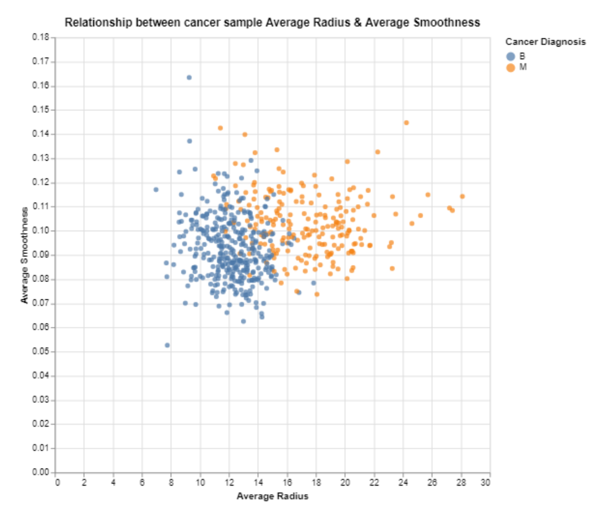
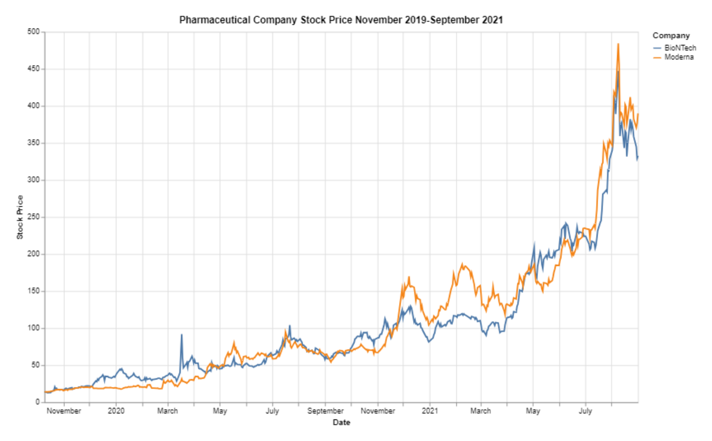
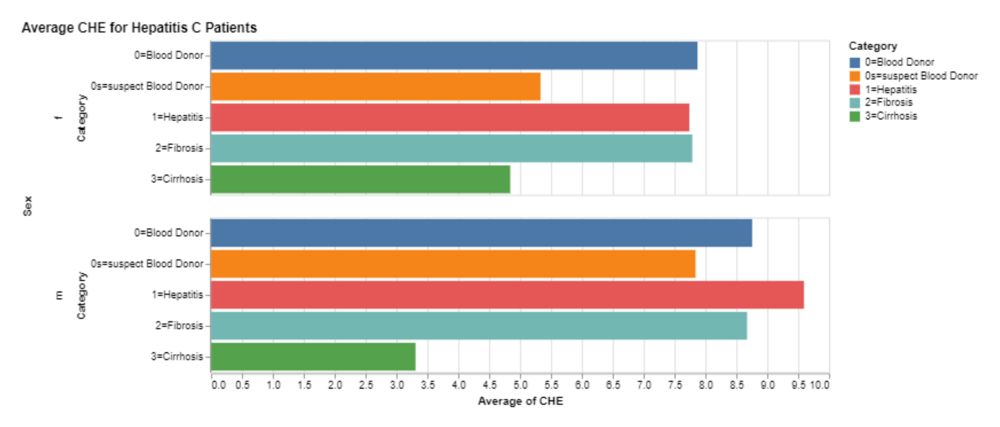
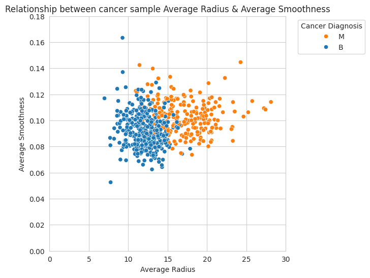

# HW 3 - CS 625, Spring 2024

AJ Broderick *(UIN 01244170)* <br>
Due: February 16, 2024

**Links to associated assignment files**\
[Observable Workbook](https://observablehq.com/d/a4def6f58884a3c9)\
[Google Colab](https://colab.research.google.com/drive/1FVS0k8aoPLFzZ2vm30N7eCrZ3TGhAZqG#scrollTo=NqiSlbnWcIOw)

## Data
When looking through the datasets that were available on [GitHub](https://github.com/MainakRepositor/Datasets)'s repository of dataset, I tried to look for ones relating to the medical industry. 
This was to align with the functions that I work with in my current job. Medical data is widely available to allow for multiple groups to do research on the same dataset, and compare results of analysis. /
From this, three main datasets were selected.

1. [Breast Cancer Dataset](https://github.com/MainakRepositor/Datasets/blob/master/Breast%20Cancer%20Dataset.csv) \
**About the Data**\
&emsp;The Breast Cancer dataset contains rows of data, each with an associated Id for the patient that was diagnosed with cancer.
There is only one categorical column, which describes whether or not the cancer was malignant(M) or benign(B),
the remaining columns contain quantitative data that describe various measures of the cancer sample. \
**Data Preparation**\
&emsp;This data was clean from the get-go and did not require any prework to make the data usable for the visual.

2. [Vaccine Stocks](https://github.com/MainakRepositor/Datasets/blob/master/vaccine%20stocks.csv) \
**About the Data**\
&emsp;This dataset takes a look at the stock price and vaccine inventory levels for a variety of Pharmaceutical companies, over a selected period of time.
For most of the data the columns in the data quantitative, which the exception of the first column that gives the date for when the stock price and inventory levels were captured.\
**Data Preparation**\
&emsp;Even when looking at the data in GitHub, it can be seen that the column headers aren't clean. For each of the companies, there are five columns all with the same entry and the second row gives what the column is displaying.
Also the column what has the date is labeled 'Ticker'. The usable data isn't available until the fourth row.
      1. *Preparation - Observable*\
When the data was used in Observable, it was uploaded (as *"vaccine stocks"*) as an attachment, which brought the data in as a table. 
After that was completed, SQL<sup>1</sup> was used to pull the columns that were selected for the visualization, along with filtering to remove bad rows of data.
     2. *Preparation - Google Colab*\
Python made the cleanup of the data a lot easier in the process. Once the data was brought into the notebook, the first three rows of data were removed to get rid of the rows of bad data.
From there, two dataframes were created for each of the companies that were selected to analyze, and then the dataframes were then appended to create the final dataset. 

**Observable SQL to clean data**
```
SELECT column00 as "Date", column04 as "Stock Price", 'BioNTech' as "Company"
FROM "vaccine stocks"
WHERE column00 not in ('Ticker','Stock Info','Date')
    UNION
SELECT column00 as "Date", column10 as "Stock Price", 'Moderna' as "Company"
FROM "vaccine stocks"
WHERE column00 not in ('Ticker','Stock Info','Date')
``` 
**Google Colab Python to clean data**
```
vaccineStock = vaccineStock[2:]
BioNTech = pd.DataFrame(vaccineStock.groupby(['Ticker'])['BioNTech.3'].agg('mean'))
BioNTech['Company'] = 'BioNTech'
BioNTech = BioNTech.rename(columns={"BioNTech.3": "Stock Price"})
Moderna = pd.DataFrame(vaccineStock.groupby(['Ticker'])['Moderna.3'].agg('mean'))
Moderna['Company'] = 'Moderna'
Moderna = Moderna.rename(columns={"Moderna.3": "Stock Price"})

vaccine = BioNTech.append(Moderna, ignore_index=False)
```
     

3. [Hepatitis C](https://github.com/MainakRepositor/Datasets/blob/master/HepatitisCdata.csv)\
**About the Data**\
&emsp;In the final dataset, data was collected from various patients from with Hepatitis C. A majority of the data is quantitative data that corresponds to values from the patient during an exam at the doctor's office.
There are two columns that describe the patient, including the age of the patient and their gender. There is an additional column that breaks the patient into different categories, but is unclear how each patient ends up in each category.\
**Data Preparation**\
&emsp;From an initial glance the data appeared to be clean, but upon further review there were records that did not have all of the columns populated.
Cleanup of the data could be done, however for this analysis columns were selected that had all of the rows populated.

## Visualization Idioms

***Scatterplot***\
&emsp;The Breast Cancer data was used to create the scatterplot, and was chosen since it contained most quantitative date; perfect for a scatterplot. 
Any selection of two of these quantitative columns could be selected to observe any correlation between them. 
By also utilizing the diagnosis column, an additional layer of observation, through color, could be created to see if there was any distinction of the columns selected below and the cancer diagnosis.
| Attribute | Attribute Type  | Encode | 
| --- |---| --- |
| radius_mean | quantitative | x-axis |
| smoothness_mean | quantitative | y-axis |
| diagnosis | categorical | color |

***Multiple Line Chart***\
&emsp;The Vaccine Stock dataset was used to create the multiple line chart. The first thing that jumped out as to why this data would be best for this type of chart was the inclusion of a date field.
This could be placed on the x-axis to highlight the movement of time closer to today as the values moved from left to right.
From there, the fact that the data had categorical and quantitative columns assisted in the selection of the line chart, where the quantitative column would serve as the y-axis and the categorical column
would be used as the color to create the multiple lines.
| Attribute | Attribute Type  | Encode | 
| --- |---| --- |
| Date | temporal | x-axis |
| Stock Price | quantitative | y-axis |
| Company | categorical | color |

***Bar Chart***\
&emsp;Finally the Hepatitis C Data was used to create the bar chart. This dataset had multiple categorical and quantitative columns to choose from, which any two could be selected to use as the x-axis & y-axis.
| Attribute | Attribute Type  | Encode | 
| --- |---| --- |
| CHE | quantitative | x-axis |
| Sex | categorical | y-axis |
| Category | categorical | row & hue |

## Creating Charts

### **Observable Charts**
***[Scatterplot](https://observablehq.com/d/a4def6f58884a3c9#cell-9)***

<p align ="center"></p>

```
vl.markCircle()
  .data(cancer)
  .title("Relationship between cancer sample Average Radius & Average Smoothness")
  .encode(vl.x().fieldQ("radius_mean").title("Average Radius"),
          vl.y().fieldQ("smoothness_mean").title("Average Smoothness"),
          vl.color().field("diagnosis").title("Cancer Diagnosis")
         )
  .width(500)
  .height(500)
  .render()
```
---
***[Multiple Line Chart](https://observablehq.com/d/a4def6f58884a3c9#cell-106)***
<p align ="center"></p>

```
vl.markLine()
  .data(vaccine)
  .title("Pharmaceutical Company Stock Price November 2019-September 2021")
  .encode(
  vl.x().fieldT("Date"),
  vl.y().fieldQ("Stock Price"),
  vl.color().fieldN("Company")
    )
  .width(800) 
  .height(500)
  .render()
```
---
***[Bar Chart](https://observablehq.com/d/a4def6f58884a3c9#cell-252)***
<p align ="center"></p>

```
vl.markBar()
  .data(hepc)
  .title("Average CHE for Hepatitis C Patients")
  .encode(
    vl.y().fieldN("Category"),
    vl.x().average("CHE"),
    vl.row().fieldN("Sex"),
    vl.color().fieldN("Category")
  )
  .width(600)
  .height(150)
  .render()
```
---
### **Google Colab Chart**
***[Scatterplot](https://colab.research.google.com/drive/1FVS0k8aoPLFzZ2vm30N7eCrZ3TGhAZqG#scrollTo=75TtRcPec2QO&line=3&uniqifier=1)***
<p align ="center"></p>

```
palette ={"M": "C1", "B": "C0"}

fig, ax = plt.subplots(figsize=(6, 6))

sb.set_style("whitegrid")
sp = sb.scatterplot(data=cancer, x='radius_mean', y='smoothness_mean', hue='diagnosis', palette=palette)
sp.set_title("Relationship between cancer sample Average Radius & Average Smoothness")
sp.set_xlabel("Average Radius")
sp.set_ylabel("Average Smoothness")
sp.legend(title='Cancer Diagnosis',loc='upper right', bbox_to_anchor=(1.35, 1))
sp.set_xlim(0,30)
sp.set_ylim(0,0.18)
```

## Reflection
&emsp;The scatterplot was the visual that was created via Vega-Lite in Observable & Python in GoogleColab, and the chart that was created using Vega-Lite had a better experience. One of reasons that it was better was  the scaling of the axis was not altered when the visual was created, where Python automatically made adjustments to zoom in on the datapoints. By automatically changing the axis, it can create false assumptions if the user does not notice that the axis starts at a non-zero number. \
&emsp;When trying to get the two charts to appear the same, the color coding of the diagnosis needed to be adjusted. In Vega-Lite, it appears to be easier to set a color to a category, but with Python there was a little more prework that neeeded to done<sup>2</sup>. This included creating an array of what values and what order they needed to be in to get the colors to match. \
&emsp;Other than the factors mentioned above, the code to create the scatterplot were very similar in nature of where the attributes needed to be inputted.

## References
<sup>1</sup>[Observable - Working with SQL](https://observablehq.com/@observablehq/working-with-sql)\
<sup>2</sup>[Stack Overflow - Change color according to hue name](https://stackoverflow.com/questions/46173419/change-bar-color-according-to-hue-name)
