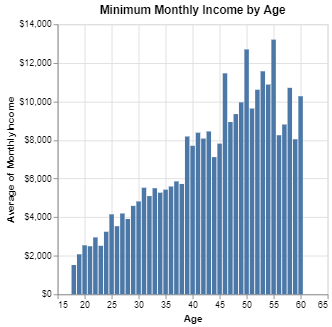

# HW 4 - CS 625, Spring 2024

AJ Broderick *(UIN 01244170)* <br>
Due: March 9, 2024

**Links to associated assignment files**\
[Observable Workbook](https://observablehq.com/d/a820924d41d06f9f)

## Data
&emsp; For this assignment, I chose to use the information from [**Dataset 3 - Employee Compensation**](https://data.world/city-of-phoenix/2b41f4f8-fe6f-48d3-8097-ad44ee5bd616), which encompassed data for various employees that are employed by the City of Pheonix. Within the dataset there are different attributes for the employee ranging from demographic, such as gender and age, to more internal metrics for the company, such as length of tenure with the City of Pheonix, distance that employee is from the office, and metrics related to pay. \
&emsp; The data appears to be uniform and well-kept in nature, meaning that there wasn't any data prep or cleaning that was needed to create the visuals for analysis.

## [★★] Questions 
#### Q2 - Job satisfaction and gender: Are women more satisfied than men at work?
<p align ="center"><a href="https://observablehq.com/d/a820924d41d06f9f#cell-72"></a></p>

<div align="center">
  
| Attribute | Attribute Type  | Encode | 
| --- |---| --- |
| Age | quantitative | x-axis *(binned)* |
| Job Satisfaction | quantitative *(average)* | y-axis |
| Gender | categorical | hue |

</div>

&emsp; To answer this question a set of paired bar charts, that breaks out the data by gender, were created to look at the average job satisfaction rating. The data was then binned into age group, at intervals of 10 years, yielding 5 pairs of bar charts. By creating the charts this way, it allows some additional information to be parsed from the data. If the binning did not occur, the resulting image would give a basic answer of if women are happier than men at this company. \
&emsp; With the binning, we can see that for the most part women and men are fairly equally satisfied while working at this company. However, for the employees that are between the age of 50-60, it can be seen that women are less satisfied than their male colleagues. 

```
{
  "$schema": "https://vega.github.io/schema/vega-lite/v5.json",
  "data": {"values":emp_comp},
  "title": "Job Satisfaction by Gender and Age Group",
  "width": 190,
  "height" : 250,
  "mark": "bar",
  "encoding": {
    "column": {"bin": true, "field": "Age"},
    "x": { "field": "Gender"},
    "y": {"field": "JobSatisfaction", "aggregate": "average"},
    "color": {"field": "Gender", "legend": null}
  },
  "layer": [
    {
      "mark": {"type": "bar", "align": "line-top", "baseline": "center", "dx": 3, "angle": -60},
      "encoding": {
        "column": {"bin": true, "field": "Age"},
        "x": {"field": "Gender"},
        "y": {"field": "JobSatisfaction", "aggregate": "average"},
        "color": {"field": "Gender", "legend": null},
        "text": {"field": "JobSatisfaction", "type": "quantitative", "aggregate": "average", "format": ".0f"}
      }
    }
  ]
}
```

-----

#### Q4 - Which department-based employees receives the lowest median hourly rate?
<p align ="center"><a href="https://observablehq.com/d/a820924d41d06f9f#cell-120"></a></p>

<div align="center">
  
| Attribute | Attribute Type  | Encode | 
| --- |---| --- |
| Hourly Rate | quantitative | x-axis |
| Department | categorical | y-axis |
| Department | categorical | hue |

</div>

&emsp; As soon as the word median was seen, it was determined that a boxplot chart would be the best chart to use to answer the question. The hourly rate column was used as the main quantitative column to display the upper & lower quartiles, the median, and any outliers that might have been present. To ensure that the question could be answered, the department was pulled in on the y-axis to split the data between the three departments. Finally the department was used as a color aspect, and this was done to help differentiate the different departments from one another. \
&emsp; From this, it can be seen that employees in the Human Resources department have the lowest median hourly rate. However, the employees in the Human Resources department have the largest spread in hourly rate; which is denoted by the largest size of the box in the boxplot.

```
{
  "$schema": "https://vega.github.io/schema/vega-lite/v5.json",
  "data": {"values":emp_comp},
  "title": "Hour Rate Spread by Department",
  "mark": {
    "type": "boxplot",
    "extent": "min-max"
  },
  "encoding": {
    "y": {"field": "Department", "type": "nominal"},
    "color": {"field": "Department", "type": "nominal", "legend": null},
    "x": {"field": "HourlyRate","type": "quantitative", "axis": {"format": "$,.0f"}}
  }
}
```

## [★] Question 
#### Q1 - What is the average monthly income of employee by marital status?
<p align ="center"><a href="https://observablehq.com/d/a820924d41d06f9f#cell-68"></a></p>

<div align="center">
  
| Attribute | Attribute Type  | Encode | 
| --- |---| --- |
| MaritalStatus | categorical | y-axis |
| Monthly Income| quantitative | x-axis |
| Monthly Income| quantitative | text label |
| Monthly Income| quantitative | order sort |

</div>

&emsp; A simple bar chart was developed to answer this question of if there is a spread in monthly income based on the employee's marital status. The `MonthlyIncome` was used to calculate the mean rate, and then the `MaritalStatus` was used on the y-axis to separate the different groups. To assist in making the answer easy to answer without much cognitive thought, the Marital Status was sorted in a descending order based on the average calculation. The calculation was also layered in as a text layer to know exactly what the average monthly income amount was.\
&emsp; From the chart, Single employees make less money than their married and/or divorced colleagues. There is a very small variance between those that are currently married and those who now divorced. 

```
{
  "$schema": "https://vega.github.io/schema/vega-lite/v5.json",
  "data": {"values":emp_comp},
  "title": "Average Monthly Income by Employee Marital Status",
  "width": 300,
  "height" : 150,
  "encoding": {
    "y": {"field": "MaritalStatus", "type": "nominal"},
    "x": {"field": "MonthlyIncome", "aggregate": "average", "sort": "ascending", "title": "Average Monthly Income", "axis": {"format": "$,.0f"}}
    },
  "layer": [
    {"mark": "bar"}, 
    {"mark": {
      "type": "text", "align": "left", "baseline": "middle", "dx": 3},
      "encoding": {"text": {"field": "MonthlyIncome", "type": "quantitative", "aggregate": "average", "format": "$,.0f"}
    }}
  ]
}
```

## Additional Questions Answered 
#### Q5 - Identify any two pairs of attributes in the dataset that have the notable positive correlation and negative correlation respectively (should be high or very high).  [★★]
<p align ="center"><a href="https://observablehq.com/d/a820924d41d06f9f#cell-134"></p>

<div align="center">
  
| Attribute | Attribute Type  | Encode | 
| --- |---| --- |
| Age | quantitative | x-axis |
| MonthlyIncome | quantitative | y-axis  |

</div>

&emsp; This question was difficult to develop from the lack of information about the columns presented in the data along with the type of data that presented. Starting with the lack of information, some of the columns were easy to determine what the data meant, such as `Age` and `DistancefromHome`, however there were other columns that were harder to decipher. These columns were the ones relating to the Rates for each employee. Without knowing what these quantitative columns were displaying it made hard to display correlation between them. The other reason this question was hard was many of the quantitative columns had discrete numbers in them, so any correlation detection from a scatterplot could not be determined. \
&emsp; To create a visual that showed positive correlation, two columns that intuitively are related were selected. These columns were `Age` and `MonthlyIncome`, where a bar chart displaying the average monthly income for each employee age was created. This showcased a positive relationship where younger employees had a lower average income than their more seasoned colleagues. This makes sense that years of experience of work result in being offered a higher salary.

```
{
  "$schema": "https://vega.github.io/schema/vega-lite/v5.json",
  "title": "Minimum Monthly Income by Age",
  "width": 300,
  "height" : 300,
  "data": {"values":emp_comp},
  "mark": "bar",
  "encoding": {
    "x": {"field": "Age", "type": "quantitative"},
    "y": {"field": "MonthlyIncome", "type": "quantitative","aggregate": "average"}
  }
}
```

-----

#### Q8 - Display the total number employees by their roles by distribution plot. [★]
<p align ="center"><a href="https://observablehq.com/d/a820924d41d06f9f#cell-140"></a></p>

<div align="center">
  
| Attribute | Attribute Type  | Encode | 
| --- |---| --- |
| Job Role | categorical | x-axis |
| Department | categorical | hue |

</div>

&emsp; For this last question, a bar chart was used again to display the data. This type of chart was selected because it's one of the easiest to work with when working a count of the number of records in a dataset, which is what this question was alluding towards. By having the counts are the bar lengths, it makes it easier to see which role is the most popular at the company, and the counts are displayed at the end of the bars. As with the last bar chart, the data was sorted in ascending order to create an ease in reading the data. One thing that was done to add some more context for answering more than one question via the visual was that the Department was pulled in as a hue. This then allows for knowing which department(s) a select role belongs to. 

&emsp; At this company, Sales Executives is the most common job role and Human Resources is the least common. One thing that is interesting is that even though the Sales Department has most common job role, it is not the largest department. By adding all the job roles for Research and Development, that department has the most employees and has the most diverse amount of job titles.

```
{
  "$schema": "https://vega.github.io/schema/vega-lite/v5.json",
  "data": {"values":emp_comp},
  "title": "Employee Count based on Department",
  "width": 300,
  "height" : 200,
  "mark": "bar",
  "encoding": {
    "x": {"field": "JobRole", "sort": "y"},
    "y": {"aggregate": "count"},
    "color": {"field": "Department", "type": "nominal"}
  },
  "layer": [
    {"mark": "bar"}, 
    {"mark": {
      "type": "text", "align": "line-top", "baseline": "center", "dx": 3, "angle": -60},
      "encoding": {"text": {"aggregate": "count"}
    }}
  ]
}
```

## References
<sup>1</sup> [Vega-Lite: Example Gallery](https://vega.github.io/vega-lite/examples/#interactive-charts) - The Example Gallery was used primarily to create the framework for each visual and then adjusted for the selected dataset \
<sup>2</sup> [Vega-Lite: Format](https://vega.github.io/vega-lite/docs/format.html) - Reference material from Vega was used to format the axis to show as dollar amounts
