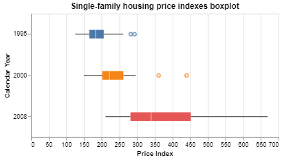
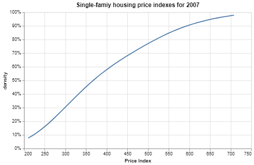
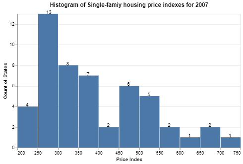
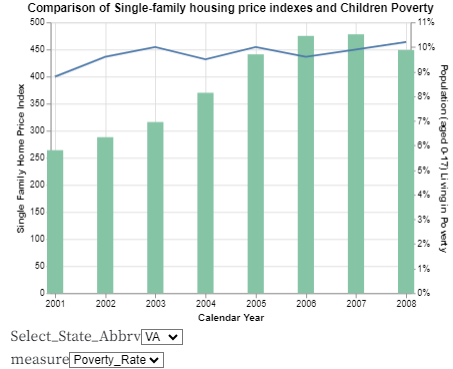
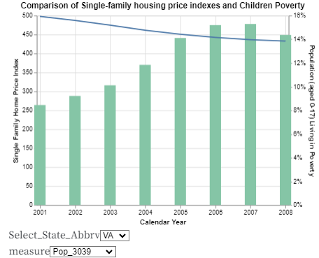

# HW 5 - CS 625, Spring 2024

AJ Broderick *(UIN 01244170)* <br>
Due: March 30, 2024

**Links to associated assignment files**\
[Observable Workbook](https://observablehq.com/d/ada5b71b7e239ebc)

## Data
&emsp; For this assignment, I chose to use the information from [**Dataset 1 - Section 14. Prices. Table 713 **](https://www.census.gov/library/publications/2009/compendia/statab/129ed/prices.html), which reflects the average change in price on the same properties with a baseline amount from 1980. The information is aggregated by State, and at the time of it's recording had data through the end of 2008. When the index increases, it reflects and increase on the overall price of houses in that State, and conversely decreases when the price of the same house decreases in price. \
&emsp; When the data was downloaded, the information was displayed in a tabular format. Whilst this format is good for reporting, it needed to be reconfigured before it could be used for further analytics. By being in the tabular format the States were listed down in rows and the years along the columns, and the subsequential data located in the cells. The data was unpivoted where the columns included the States and Reporting Year, which yielded an increased number of rows in the dataset, but created an easier dataset to create visuals from. One final piece of data cleansing that was done was to remove the District of Columbia, as it was an ask by the end user. \
&emsp; The data for Virginia is displayed below as an example of the how the end dataset appeared. 

<div align="center">
  
| State_Name | State_Abbrv  | Price_Index | Cal_Year | 
| --- |---| --- | --- |
| Virginia | VA | 184 | 1990 |
| Virginia | VA | 180 | 1991 |
| .... | .... | .... | .... |
| Virginia | VA | 478 | 2007 |
| Virginia | VA | 449 | 2008 |

</div>

## Part 1 - Distribution Charts 

### Boxplot
<p align ="center"><a href="https://observablehq.com/d/ada5b71b7e239ebc#cell-199"></a></p>

<div align="center">
  
| Attribute | Attribute Type  | Encode | 
| --- |---| --- |
|   Cal_Year  |   temporal  | y-axis  |
|   Cal_Year  |   temporal  | filter  |
|   Cal_Year  |   temporal  |  color  |
| Price_Index | quantitative| x-axis  |

</div>

&emsp; Before the visual could be created, the dataset needed to be filtered based on the requirements from the end user. The ask was to look at the spread of the price index across states for a select number of years(1995, 2000 & 2008), and the data was filtered using the `"transform" : {"filter": ..."` function<sup>1</sup>. By utilizing this function the selected years would be the only datasets to appear in the visual. After this was done, the actual encoding of the visual could be done to create the boxplot to show the spread of the price index. The `Price_Index` was used in the x-axis to display the min/max, mean and any outliers that existed in the dataset. The `Cal_Year` was used many different times in the encoding to create an effective visual, and the first was in the filter as described before. It was then used in the y-axis to separated the selected years, and again used as categorical color to create clear distinction between the years. \
&emsp; From the boxplot a handful of observations can be made, both from a perspective of the individual years and from an overall trend in the price index. Starting with 1995, there was not a large overall spread in the cost index across all the States, however there are two outliers that exist on the upper side of the index. Moving on to 2000, the median is now lower to the lower quartile but the overall spread has not changed too much. It is also worth pointing out there are still two outliers and they have moved further away from the rest of the values. Finally for 2008, the spread in the index has increased substantially on the upper quartile that the previous outliers now no longer appear as outliers. \
&emsp; The observations from above align with the statement that the overall cost index has increased over time. This means that the same houses are being sold for higher and higher prices over the last two decades, which aligns with the conventions of the law of supply and demand. From the increased trend, there appears to be a handful of States that grow faster than others. This is why the upper quartile extended faster than the mean and lower quartile and made the initial outliers more aligned to the rest of the dataset.

```
{
  "$schema": "https://vega.github.io/schema/vega-lite/v5.json",
  "data": {"values":housing},
  "title": "Single-family housing price indexes boxplot",
  "width": 400,
  "height" : 200,
  "mark": {"type": "boxplot"},
  "transform" : [{"filter": {"field": "Cal_Year", "oneOf": ["1995", "2000", "2008"]}}],
  "encoding": {
    "y": {"field": "Cal_Year", "type": "nominal", "title" : "Calendar Year"},
    "color": {"field": "Cal_Year", "type": "nominal", "legend": null},
    "x": {"field": "Price_Index","type": "quantitative", "title" : "Price Index"}
  }
}
```

-----

### eDCF
<p align ="center"><a href="https://observablehq.com/d/ada5b71b7e239ebc#cell-202"></a></p>

<div align="center">
  
| Attribute | Attribute Type  | Encode | 
| --- |---| --- |
| Cal_Year | temporal | filter |
| Price_Index | quantitative | x-axis |
| Price_Index | quantitative | density |

</div>

&emsp; Similar to the boxplot, the data needs to be filtered before the visual can be created. Unlike the boxplot, where multiple years were filtered for, the user has requested a single year to be used for the analysis of the eDCF, and the year 2007 was selected. This was done for two reasons, and the first was data accuracy; where by not looking at the most recent year in the dataset, it ensures that all the data had time to successfully be processed. While this might not have been an issue since the data was collected by Census Department, it's still something to consider in these types of datasets. By selecting 2007, the data is still fairly "fresh" where any observations from the visual are found can still provide meaningful action.\
&emsp; Now that a single year has been isolated the eDCF can be created, and to do so the `"density"`<sup>2</sup> function within `"transform"` is used. By utilizing this function, the `Price_Index` column was used as the metric to determine the distribution of the values within 2007. Also within the function, there is an option for `"cumulative"` that is available and it was set to true. If this had not been stated, it would default to false and the resulting visual would create distribution curve that could be used to see if the data was normally distributed. By setting it to true, it creates the running total in the distribution that creates the shape that makes an eDCF.\
&emsp; From the visual it can been seen that the price indexes range from a little over 200 *(at 210)* to just over 700 *(at 703)*. These values align with the 2008 boxplot that was created earlier. This chart can be used to determine if there are areas where the price indexes might be concentrated where this would be shown as a steeper slope along the line. This might be the case for the 2007, which contains an area where the slope appears as a straight line towards the beginning of the curve, before creating more of an arc with the remaining values. A user could also use this report to state where certain percentiles fall, and what the corresponding price index is. For example the 80th percentile, meaning 80% of the values, are at or below 507.

```
{
  "data": {"values": housing},
  "width": 500,
  "height": 300,
  "title": " Single-famiy housing price indexes for 2007",
  "transform":[
    {"filter": {"field": "Cal_Year", "equal": "2007"}},
    {"density": "Price_Index", "cumulative": "true"  /*needed for cumulative dist*/ }],
  "mark": {"type": "line","tooltip": true},
  "encoding": {
    "x": {"field": "value", "type": "quantitative", "title": "Price Index"},
    "y": {"field": "density", "type": "quantitative", "axis": {"format": "%"}}
  }
}
```

-----

### Histogram
<p align ="center"><a href="https://observablehq.com/d/ada5b71b7e239ebc#cell-204"></a></p>

<div align="center">
  
| Attribute | Attribute Type  | Encode | 
| --- |---| --- |
| Cal_Year | temporal | filter |
| Price_Index | quantitative | y-axis |

</div>

&emsp; 2007 was used again for the creation of the final visual requested, a histogram of the price indexes. To create a histogram, the coding starts similar to a bar chart, but needs additional features to transform it into the histogram. To create the x-axis that will contain the bins of the price indexes, `"bin"` is pulled in to the x encoding, and set to true. This binning was then set to act on the `Price_Index` column. For the y-axis, `"aggregate" : "count"` was used, and this was done to create the count of records that would fall in the bins created for the x-axis.\
&emsp; One additional feature that was created for the histogram to create an ease of use and that was adding a layer displaying the counts in each bars. This would allow the user to know very quickly the count for each bar without much thought. To create this, the `"layer"` function was used, and basically used a lot of the same coding for the y-axis that created the histogram.\
&emsp; From the resulting histogram, a statement from eCDF is then confirmed. By looking at the spread of the counts, there is a positive skew in the data where there are more values on the lower end of the histogram. This clustering of the histogram is what caused the eDCF to be more linear at the beginning of the line, as opposed to having an arc. Also from the chart, each of the bins that were created have at least one value that falls in is. This confirms that the bin size are appropriately sized, and also highlights that there isn't any data that would be classified as an outlier.

```
{
  "$schema": "https://vega.github.io/schema/vega-lite/v5.json",
  "data": {"values":housing},
  "width": 500,
  "height" : 300,
  "title": " Histogram of Single-famiy housing price indexes for 2007",
  "transform":[{"filter": {"field": "Cal_Year", "equal": "2007"}}],
  "mark": "bar",
  "encoding": {
    "x": {"bin": true, "field": "Price_Index", "title": "Price Index"},
    "y": {"field": "Price_Index", "aggregate": "count", "title": "Count of States"}
  },
  "layer": [
    {"mark": "bar"}, 
    {"mark": {
      "type": "text", "align": "line-top", "baseline": "center", "dx": -4},
      "encoding": {"text": {"field": "Price_Index", "type": "quantitative", "aggregate": "count"}
    }}
  ]
}
```

## Part 2 - Further Analysis 

### Additional Data

&emsp; From the charts that were created in part one, it was apparent that the cost of single-family home had grown from when the data was first started to be collected in 1980. With that being said, the remainder of this analysis was focused around understanding if there was an correlation between these increased housing prices and other socioeconomic factors. One of the benefits of the first dataset was that it contained data over time along with being reported by State. This allowed for additional data to be collected and joined with it to allow for further analysis. By utilizing data collected by the Center for Disease Control (CDC), additional datapoints were extracted and are outlined below on hypothesis of how they interact with the initial pricing index data 

  * [CDC - Bridged-Race Population Estimates](https://wonder.cdc.gov/Bridged-Race-v2008.HTML)
    * Percent of Population that is between the age of 30-39
      * From personal experience, this grouping of the population is one of the largest in terms of looking for single-family housing, whether it be their first home, or looking for a new home for their growing families. The hypothesis is that this age group is growing in size, and then therefore there is more demand for these houses, which is driving the price of housing up
  * [CDC - EPH Tracker](https://ephtracking.cdc.gov/DataExplorer)
    * Percent of children (age 0-17) living in poverty
      * Given that the prices of houses are continuing to rise, the prices on other goods are also on the rise. With the increased price on goods and services it is pushing more and more families into a state of poverty. Therefore as the price index increase, this percentage will rise with it

For the population metric, that data was available for the same timeframe as the initial dataset, however the data relating to poverty was not, starting in 2000. This would cause any additional charts to only be usable for 2000-2008. These metrics were calculated and then appended to the initial data, resulting in a dataset that would appear as followed:

<div align="center">
  
| State_Name | State_Abbrv  | Price_Index | Cal_Year | Poverty_Rate | Pop_3039 | 
| --- |---| --- | --- | --- | --- | 
| Virginia | VA | 184 | 1990 | | 0.1751 |
| Virginia | VA | 180 | 1991 | | 0.1766 |
| .... | .... | .... | .... | ...| ... |
| Virginia | VA | 478 | 2007 | 0.099 | 0.1396
| Virginia | VA | 449 | 2008 | 0.102 | 0.1384

</div>

&emsp; To attempt to observe any correlation between the price index and the additional data points, a combination chart would need to be created. This is due to the data existing in separate columns as well as the scale of the new data differs from the scaling of the price index. VegaLite does support combination charts, through the use of dual-axis and use of the `"layer"` function twice<sup>3</sup>.\
&emsp; Finally to create an interactive function in the analysis, dropdowns were utilized. These dropdowns would give the end user the ability to chose which of the additional datapoints they would like to see as the second axis of the chart. The user would also be able to select a single State, to see there existed different trends and stories for one state as opposed to another. To create the dropdowns, the `"params"` function was utilized to achieve the interactivity<sup>4</sup>. 

<p align ="center"></p>

&emsp; Using Virginia as the example of how to read the visual, starting with the price index trend with the poverty rate trend layered in as well, there isn't a strong correlation between the two variables. The price of houses in Virginia have increase from 2000 to 2007 and then dipped a little in 2008, however the rate of children living in poverty has not changed with the same magnitude as the change in the price of houses. This disproved the hypothesis that the changes in the prices of housing can be seen in the number of children living in poverty. It is worth noting that this is just for one State, and the visual was coded to be able to change States and the story can change from State to State.\
&emsp; Finally when looking at the percentage of the population in Virginia that are between the age of 30 and 39 when compared to the trend in price index, there is a story that was not expected. Whilst the price index has increased over time, thirty year olds have made up less and less of the population. After thinking about it, the trend makes sense as life expectancy has increased, creating a larger base for the calculation. To enhance the story of the visual, it would be interesting to layer in the buying power of the thirty year olds. Then it would highlight any differences in the changes in the prices of houses and the ability for thirty year olds to purchase a house. Similar to before, this is just the story for Virginia, and the story might be different for a different State.

```
  {
  "$schema": "https://vega.github.io/schema/vega-lite/v5.json",
  "title": "Comparison of Single-family housing price indexes and Children Poverty",
  "width": 400, "height": 300,
  "data": {"values":housing},
  "transform": [
    {"filter": {"and":[  {"param":"Select"}, {"timeUnit": "year", "field": "Cal_Year", "range": [2000, 2008] } ] }},
    {"calculate": "datum[measure]", "as": "y"}
  ], 
  "params" : [ {"name": "measure", "value": "Poverty_Rate", "bind": { "input": "select","options": ["Poverty_Rate", "Pop_3039"]}}],
  "encoding": {
    "x": {"field": "Cal_Year", "type": "temporal", "title": "Calendar Year"}
  },
  "layer": [
    {
      "mark": {"type": "bar", "color": "#85C5A6", "width": {"band": 0.7}},
      "encoding": {
        "y": {"aggregate": "average", "field": "Price_Index", "title": "Single Family Home Price Index"}
      }
    },
    {
      "params": [
        {"name": "Select",
          "select": {"type": "point", "fields": ["State_Abbrv"]},
          "value": 'VA',
          "bind": {"input": "select", "options": [
            'AL','AK','AZ','AR','CA','CO','CT','DE','FL','GA',
            'HI','ID','IL','IN','IA','KS','KY','LA','ME','MD',
            'MA','MI','MN','MS','MO','MT','NE','NV','NH','NJ',
            'NM','NY','NC','ND','OH','OK','OR','PA','RI','SC',
            'SD','TN','TX','UT','VT','VA','WA','WV','WI','WY']}
        },
        {"name": "measure", "value": "temp_max", "bind": { "input": "select","options": ["temp_max", "precipitation", "wind"]}}
      ],
      "mark": {"type": "line"},
      "encoding": {
        "y": {"aggregate": "average", "field": "y", "title": "Population (aged 0-17) Living in Poverty", "axis": {"format": "%"}}
      }
    },
  ],
  "resolve": {"scale": {"y": "independent"}}
}
```

## References
<sup>1</sup> [VegaLite - Filter](https://vega.github.io/vega-lite-v3/docs/filter.html) </br>
<sup>2</sup> [Observable - ODUCS Vis](https://observablehq.com/@oducs-vis/visualizing-distributions-examples-in-vega-lite) </br>
<sup>3</sup> [VegaLite - Layer Dual Axis](https://vega.github.io/vega-lite/examples/layer_dual_axis.html) </br>
<sup>4</sup> [VegaLite - Selection](https://vega.github.io/vega-lite/docs/selection.html)
