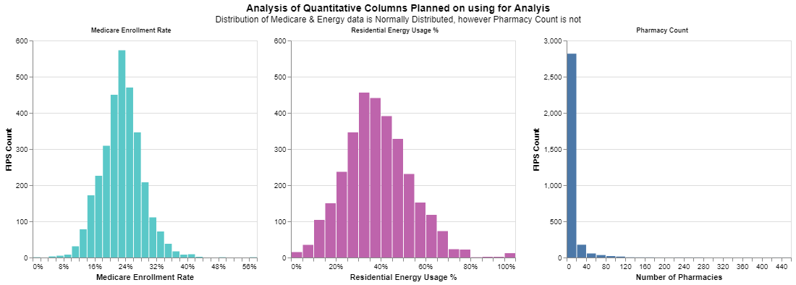
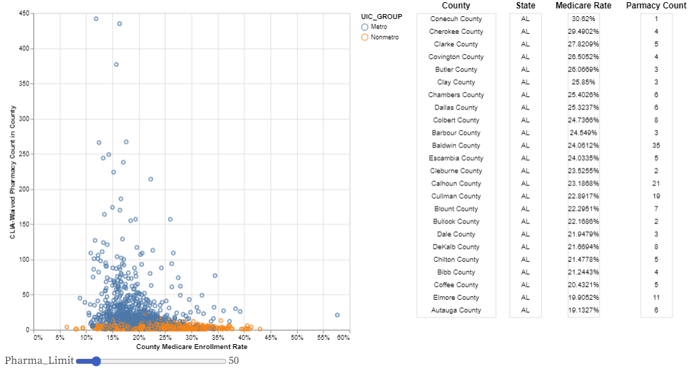

# Semester Project - CS 625, Spring 2024

AJ Broderick *(UIN 01244170)*  
Due: April 12th, 2024

**Links to associated assignment files:**\
[Google Colab - *Data Cleansing*](https://colab.research.google.com/drive/1MbS8kqOpIGdMtDvPK_hoicKQAHxWxhER?usp=sharing)\
[GitHub - *Final Data Location*](https://github.com/aj-broderick/cs625/blob/main/semesterproject/semester_project_data.csv)\
[Observable Notebook - *Visuals Coding*](https://observablehq.com/d/62bf44d588d656e3)\
[github.io - *Visuals Reporting*](https://aj-broderick.github.io/CS625_Project.html)\
[YouTube - *Visuals Demo*](https://youtu.be/4aQqVcwrsC0)

## Topic
&emsp; Medicare is a topic that is brought up often in the arena of politics for an array of reasons, ranging from it’s relevancy in modern times to discussions of costs to the American people. Throughout this analysis, Medicare enrollment will be looked at in comparison to other recorded metrics that might not have a direct influence with one another. The intent is to determine what downstream impact Medicare has on other activities that are happening in the same areas.

***Refined Questions:***

1. **In areas that have a larger count of pharmacies, is there also an increased amount of the population that is on Medicare?**\
&emsp; The hypothesis is that one of the main criteria for enrollment in Medicare is age, this population would have a large number of prescriptions that would be needed. Therefore areas with more Medicare patients would need a larger number of pharmacies to fulfill these scripts.

2. **Do areas with higher concentrations of Medicare enrollees also have a higher percentage of residential energy consumption?**\
&emsp; The hypothesis is that in more recent years, more and more people aged 65+ (a prime group for Medicare) have chosen to stay at home as opposed to relocating to a nursing home. From this some of the medical equipment that they need to use is also at their homes now, and this would create an increased need for electricity into homes.

## Data
&emsp; To achieve the analysis, multiple different data sources needed to be found and blended together. Luckily the sources selected came from government agencies, where details at were 
displayed at the macro level (State) and the micro level (County FIPS). County FIPS was an important datapoint in each of the different data sources as it acted as the primary key for joining the data. The FIPS, which stands for Federal Information Processing System, is a code that uniquely identifies geographic areas across the United States and its Providences[1]. Below describes each file location and why is was chosen to be a source of data.

***[Center for Medicare & Medicaid Services - Enrollment Statistics](https://data.cms.gov/summary-statistics-on-beneficiary-enrollment/medicare-and-medicaid-reports/medicare-monthly-enrollment/data)***\
&emsp; The first dataset served as the cornerstone of the entire analysis, as it contained the values for the number of people that were enrolled in Medicare for a selected timeframe. This data is owned by the Center for Medicare & Medicaid Services (CMS), which is the governing body of the Medicare program. Within the data, there includes information for the different types of the Medicare someone can be enrolled in, and for the sake of the analysis the total number was collected. Further analysis in the future could investigate differences between Part A and Part B.

***[Census Bureau - Survey Population](https://www2.census.gov/programs-surveys/popest/datasets/2020-2021/counties/totals/)***\
&emsp; Whilst the overall enrollment in Medicare is useful, false statements could be made without creating a consistent scale to for comparison. To level set the data, a percentage was created that compared the overall population in a County and the number of Medicare enrollees. To achieve this, population data was needed, and this was found from the Census Bureau’s survey population estimate that is updated annually. 

***[Center for Disease Control - Environmental Public Health Tracking](https://ephtracking.cdc.gov/DataExplorer)***\
&emsp; From the first two dataset, the first metric was created, and this left the challenge of finding one or more metrics to compare it to. By utilizing the Center for Disease Control’s (CDC) Environmental Public Health (EPH) Tracking tool, additional data was examined and collected. The EPH Tracker collects data, which can range from Air Quality to Medical Infrastructure, from State and Local governments and compiles them into a central database. By using the Community Characteristics Content, the overall number of Pharmacies in each County was extracted. There is an abundance of other metrics that could be pulled into the analysis in the future as well.

***[US Department of Energy - Open Energy Data Initiative](https://data.openei.org/submissions/149)***\
&emsp; Another government agency’s data that was utilized to find data included the Department of Energy’s Open Energy Data Initiative (OEDI). The OEDI is similar to the EPH Tracker, where the Department of Energy collects data from across the country and houses it in a centralized repository to enable data discoverability. The data that was collected from here was from the City and County Energy Profiles dataset that looks at electricity consumption. The energy consumption is then modeled to estimate what type of building consumed the electricity and breaks it out between residential, commercial and industrial buildings. This allowed for an estimate for the percentage of energy going to residential areas to be created for comparison to the Medicare enrollment rate.

***[US Department of Agriculture - Urban Influence Codes](https://www.ers.usda.gov/data-products/urban-influence-codes/)***\
&emsp; The final dataset was one that wasn’t adding an additional metric to compare to the Medicare enrollment, but added a categorical column that added more capabilities for analysis. This data came from the US Department of Agriculture, which takes all of the Counties in the national and groups them into one of 12 groups[2]. These groups are dependent on population and the largest City in the County, which then can be used to compare and contrast like Counties. Each of the 12 groups are also given a label of whether the County is a Metropolitan or a Non-metropolitan. Below gives an over of the final dataset that will be used in the analysis and to create the visuals.

&emsp; In the links section above, a link is present which redirects to the Google Colab used to blend and create the dataset:

  
| Id | Column | Data Source | Notes | 
| --- |---| --- | --- |
|0 |FIPS| Department of Agriculture| |
|1 |FIPS_NUM| Department of Agriculture| |
|2 |COUNTY_NAME| Department of Agriculture| |
|3 |STATE| Department of Agriculture| |
|4 |UIC_NUMBER| Department of Agriculture| |
|5 |UIC_GROUP| Department of Agriculture| |
|6 |MEDICARE_ENROLL| CMS| |
|7 |POPESTIMATE| Census Bureau| |
|8 |PHARMA_COUNT| EPH Tracker| |
|9 |ENERGY_RES| OEDI| |
|10 |ENERGY_COM| OEDI| |
|11 |ENERGY_IND| OEDI| |
|12 |ENERGY_TTL| ----- |Calculated column|
|13 |MEDICARE_RATE| ----- |Calculated column|
|14 |RESIDENTIAL_RATE| ----- |Calculated column|
|15 |MEDICARE_BIN| ----- |Calculated column|
|16 |RESIDENTIAL_BIN| ----- |Calculated column|
|17 |BIVARIATE_BIN| ----- |Calculated column|

### Data Validation
&emsp; Before creating any visualizations from the data, a quick test is done on it to test for any irregularities. If this is not done, then there is a risk that statements from the visualizations might not be accurate because the data isn't consistent. Since the visuals will be created using quantitative columns, the test that was done on the data was to check for a normal distribution of values. By checking for normal distributions, it helps in looking for outliers or skews in the data. Histograms for selected quantitative columns were created, and displayed below.\
&emsp; The Medicare Enrollment rate is normally distributed, which is a good start since it was the basis for the analysis. Moving on to the Energy usage by residential buildings, this dataset is also normally distributed, so there is confidence when using this column in conjunction with the Medicare enrollment rate. However, the data for the Pharmacy count is very skewed and has a number of outliers. This may cause issues further along in the analysis, but is good to know when looking at the output and any statements that may be made from the visualizations.

  
| Attribute | Attribute Type  | Encode | 
| --- |---| --- |
| MEDICARE_RATE | quantitative | x-axis|
| RESIDENTIAL_RATE | quantitative | x-axis |
| PHARMA_COUNT  | quantitative | x-axis|
| FIPS          | ordinal     | y-axis  |

## Question 1
**In areas that have a larger count of pharmacies, is there also an increased amount of the population that is on Medicare?**\
&emsp; This question hopes to find a pattern in the data where areas that have more pharmacies relate to a higher increase in the population that is enrolled in Medicare. Since the two columns in the data are quantitative, a scatterplot is created to plot the counties based on the Medicare enrollment rate and the number of pharmacies. An additional feature that was also encoded into the visual was whether the County is determined to be a Metropolitan by the Department of Agriculture. This was done to see there was any difference in Counties that have more Cities and if so, how much of a difference existed. The final piece of information that was encoded into the visual was creating a simple linear regression of the data, to try to give a quantitative value to any impact the Medicare enrollment rates had on the number of Pharmacies that are located in that County.

  
| Attribute | Attribute Type  | Encode | 
| --- |---| --- |
| MEDICARE_RATE | quantitative | x-axis & text |
| PHARMA_COUNT  | quantitative | y-axis & text|
| UIC_GROUP     | categorical  | color |
| COUNTY        | ordinal      | text  |
| STATE         | ordinal      | text  |

&emsp; From the visual, the results actually differed from the initial hypothesis that there would be a positive relationship between the two metrics. Starting with the Metro Counties, there existed a large number of outliers in the data, from the analysis and visual there exists a negative relationship where Counties with a higher percentage of the population  enrolled in Medicare have a lower count of Pharmacies. What was interesting was that for the Nonmetro Counties, there was no relationship at all which can be seen from the Nonmetro R2 being close to zero. 
&emsp; It is also worth noting that further analysis could be done on this to confirm the statement created by this visual. Since the Pharmacy count is discrete, it could be influenced by the overall population in the County. This could be resolved by taking the population of the County into effect, as was done with the Medicare Enrollment to create a rate, to place more of an emphasis on Counties that have only 1 Pharmacy, but has a larger overall population.

## Question 2
**Do areas with higher concentrations of Medicare enrollees also have a higher percentage of residential energy consumption?**\
&emsp; Similar to the first question, this question is looking to see what impact the Medicare enrollment rate might have on an industry in that same County. For this question, the industry is not associated with the medical industry, and that is the energy industry. When it comes to energy, the metrics that was used was creating a percentage of energy that was going to residential buildings, as opposed to industrial or commercial buildings. To avoid creating a similar visual as the first question a choropleth map was created to see if there were pockets across the US that have combinations of high/low Medicare enrollment and residential energy usage.\
&emsp; To accomplish this, class quantifications were created for both Medicare enrollment and residential energy usage. From the data validation segment that was done at the beginning of the analysis, both of the measures are normally distributed, making it so the classifications would be equal. For simplicity of the visualization, three classification bins were created using the 33rd and 66th quartiles. Once the bins were determined for each measure, they were combined to create final bin that would be used to color code the map.\
&emsp; Below highlights the concepts of creating the choropleth maps by themselves and the concatenation of the two to create the final visual:

</a>

----

**Final Choropleth Map Visual**

&emsp; Whilst there are not truly unique patterns in the visual that answer the question, it does help guide the user to areas that might be of interest. From the visual, there are a couple areas on the map that stand out when looking for the dark blue that emphasize a high concentration of Medicare enrollees and a high residential energy usage rate, and the first is in the mountain ranges in the western region of Virginia. This could be from Counties in Virginia that are low in population due to being in the Shenandoah Valley/Blue Ridge Mountains, and with that lower population also has a larger percentage of that is enrolled in Medicare. Also by being in the mountains, there aren't as many industrial & commercial buildings, leading to a higher rate of residential power. There are other areas with this concentration as well, such as in Florida, and that could be explained by the concept of Florida being a location that retirees would move to later in life. One area that also sticks out in the visual for the opposite reason is in Nevada, where there is low percentages for both metrics. In this area of the US, it is sparsely populated from the desert terrain.

&emsp; For an additional layer of interactivity, a second version of the chart was created that implemented a drop-down selection feature. This would allow for a more detailed look and analysis for a single State. The example below is for the State of Virginia that was described early as having high concentration of the metrics being analyzed.\
 
**Interactive Choropleth Map Visual**

  
| Attribute | Attribute Type  | Encode | 
| --- |---| --- |
| MEDICARE_RATE | quantitative | color scale 1 |
| RESIDENTIAL_RATE | quantitative | color scale 2 |
| FIPS | ordinal | geolocation |
| STATE | ordinal | filter|

## Project Timeline, Challenges & Final Thoughts
&emsp; Once the data was selected, the charts that I wanted immediately came to mind, but there was the challenge of which tool to create them in. From my own experience, I have worked with Tableau, so I wanted to do one of the coding methods and Vega-Lite was interesting since it was newer to me. Throughout the semester there was a lot of trial and error of how best to set up the charts to highlight the information. Some of the trials came from the Homeworks where I created some of the charts, but in the beginning they were static and very basic in nature. By the time of Homework 5, I had become more comfortable with the nuances of Vega-Lite.\
&emsp; The process in developing the charts came from building each of the different elements in isolation and then bringing all of the code together to create the final visualizations. For example, for the first question's scatterplot, the actual scatter plot was created first and validated. After that, research was done to see how the interactivity could be layered in, and that's where the brush parameter entered the picture[3]. Once that was developed and tested, the two pieces of code were combined and refined. This was the overall process for each visual, small chunks of code added little by little.\
&emsp; Because of process there was a learning curve in building the visuals and some pieces of the coding were easier than others. The areas that gave the most trouble started with the parameters. Whilst these could have been left out, it would have reduced the functionality of the charts and they would have been more static in nature, which was something that I was trying to avoid. The other hard part of the coding process was creating the choropleths. When using software like Tableau, it can detect geographical data and assist in creating maps off of those columns. For Vega-Lite, that functionality did not inherently exist, so additional work was needed via a lookup[4] and then Geoshape mapping[5]. Once I was over the learning curve it was easier to replicate and add more and more features/details into the visuals.\
&emsp; At the end of this project, I am pleased with the topic that I selected and the visuals that I created. The project assisted in my continuation in the Data Science degree by introducing Vega-Lite as another option to create visuals outside of Python & Tableau. I can take this knowledge and apply it to any other projects that I may work on and continue to build out my GitHub site to highlight my capabilities. Also there were halo effects to this project as well, with working with Python more blend data together to have a single working file to run analytics and reporting on.

## References
[1] - [Census Bureau - Understanding Geographic Identifiers](https://www.census.gov/programs-surveys/geography/guidance/geo-identifiers.html)\
[2] - [USDA - Urban Influence Codes Documentation](https://www.ers.usda.gov/data-products/urban-influence-codes/documentation/)\
[3] - [VegaLite - Brush Tables](https://vega.github.io/vega-lite/examples/brush_table.html)\
[4] - [VegaLite - Lookup](https://vega.github.io/vega-lite/docs/lookup.html)\
[5] - [VegaLite - Geoshape](https://vega.github.io/vega-lite/docs/geoshape.html)

*Other Links used for Visualization Generation:*\
[VegaLite - Projections](https://vega.github.io/vega-lite/docs/projection.html)\
[VegaLite - Concatenating views](https://vega.github.io/vega-lite/docs/concat.html)\
[VegaLite - Regression](https://vega.github.io/vega-lite/docs/regression.html)
